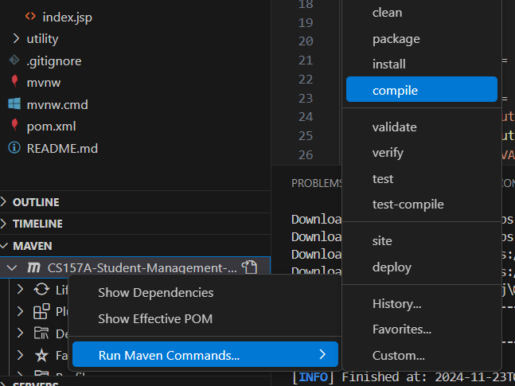

# Student Management System
### Project for CS157A Introduction to Database Management Systems - Fall 2024
<hr>

### Tools used:
- Apache Tomcat webserver
- Maven build system
- Jakarta EE package
- Postgresql
- HTMX frontend javascript library

## Setup:
Instructions are listed here for Microsoft Windows 11, similar steps should work on other platforms.
1. Start by installing the latest java development kit. 
    You can [download an installer](https://www.oracle.com/java/technologies/downloads/#jdk23-windows) from oracle.
    This should install somewhere like `C:\Program Files\Java\jdk-23`. Make note of this location.
    1. Add the jdk folder to the system environment variable JAVA_HOME. __This is an important step needed later.__
        1. Press Windows key and type `env`, click Edit the System Environment Variables.
       2. Select `Environment Variables`
       3. Under System Variables click `New` and specify: varable= `JAVA_HOME`, value= `C:\Program Files\Java\jdk-xx` (replace xx with your java version)
2. Install Apache Tomcat from their [downloads page](https://tomcat.apache.org/download-10.cgi).
   1. Extract this folder to your desired location.
   2. Open a command prompt in the /bin/ directory within the Tomcat installation
   3. Run `./startup.bat`
   4. Open a webbrowser and navigate to `localhost:8080`
   5. If everything worked correctly you should see an Apache Tomcat home page that says "If you're seeing this, you've successfully installed Tomcat. Congratulations!"
   6. Additional configuration may be needed to get this working, I would suggest making sure this runs before proceeding.
3. Install [Postgresql](https://www.postgresql.org/download/) database management server
   1. During install set the postgres user password to something secure and **do not share this.** You can leave the port as default, it should be `5432`.
   2. It is always best practice to create a new user for each application that is connecting to the database.
   3. In `psql` run `CREATE USER smsdeveloper CREATEDB CREATEROLE WITH PASSWORD <your password here>;`
4. Clone this repo somewhere (not inside of Tomcat folder)
5. On visual studio code, install two extensions
   1. **Extension Pack for Java** from Microsoft
   2. **Community Server Connectors** from Red Hat
6. Download the [Postgresql JDBC driver](https://jdbc.postgresql.org/download/). You should probably select the Java 8 driver which will work on versions newer than 8.
7. Under `/src/main/webapp/` you will need to create a directory `META-INF` containing a `lib` directory and `context.xml`.
    This will contain the database configuration and driver that you wish to use. 
    The driver jar that was downloaded in step 6 will be placed in the `lib` directory, the structure should look like this:
    ```
    src/
        main/
            java/
            webapp/
                META-INF/
                    lib/
                        postgresql-42.7.4.jar
                    context.xml
                WEB-INF/
                index.jsp
        target/
    ...
    ```
    The `context.xml` file will contain the connection information for your local postgresql database. The following context should work as long as `<password>` is replaced with the password given to the `smsdeveloper` user.
    ```xml title="context.xml"
    <Context>
        <Resource
            name="jdbc/MyPostgresDB"
            auth="Container"
            type="javax.sql.DataSource"
            factory="org.apache.tomcat.jdbc.pool.DataSourceFactory"
            driverClassName="org.postgresql.Driver"
            url="jdbc:postgresql://localhost:5432/studentmanagementsystem"
            username="smsdeveloper"
            password="<password>"
            maxActive="20"
            maxIdle="10"
            minIdle="2"
            initialSize="5"
        />
    </Context>
    ```
8. In the Maven plugin menu, right click on the server and select `Run Maven Commands > Install`.
    
    Hopefully this compiles without errors.
9. Under the `SERVERS` tab, the Community Server Connector can be set up.
    1. Right click `Community Server Connector` and select `Create New Server...`
   2. Choose `No, use server on disk`
   3. Navigate to the location of your Apache Tomcat installation
   4. Scroll down and click `Finish`, these settings should be automatically populated correctly.
10. In the `target/` directory you should find `CS157-StudentManagement-System-1.0-SNAPSHOT.war`
    If this isn't there, try running `./mvnw clean install` from a terminal in the project folder.
11. Right-click on `CS157A-StudentManagement-System-1.0-SNAPSHOT.war`. Select `Run on Server`. Choose `Tomcat 10.x`, and `No` to edit parameters.
12. The server can be started, stopped, and restarted through the `servers` menu on visual studio code.
 